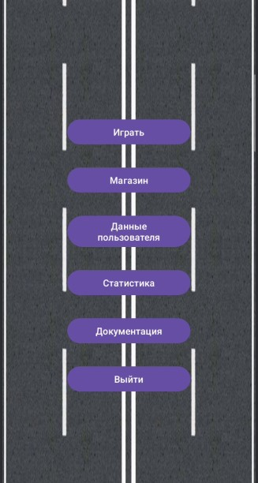

# Регистрация на сервере
Для ведения общей статистики приложение требует авторизации на своем веб - сервисе. Приложение будет успешно функционировать и без подключения к серверу, однако доступ к ведению общей статистике будет закрыт.
## Регистрация нового игрока
Для регистрации на внешнем сервисе необходимо обеспечить подключение к интернету, запустить приложение и в главном меню выбрать пункт "Данные пользователя":

  

После выбора пункта пользователь попадет в окно, где требуется внести имя пользователя и пароль. Имя должно быть уникальным и не должно повторять имена других пользователей. Далее следует нажать кнопку "Зарегистрироваться". В случае успешной авторизации приложение уведомит об этом. Если в ходе синхронизации возникли ошибки, они будут выведены на экран.

## Авторизация на сервере
Авторизация на сервере аналогична регистрации, только вместо кнопки "Зарегистрироваться" следует нажать кнопку "Войти".