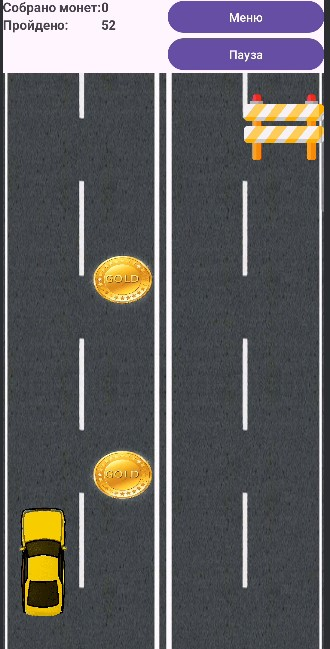

# Игровой процесс
Игровой процесс состоит в уклонении от препятствий, встречающихся на пути движения машины. За успешное продвижение по дороге начисляются очки. На дороге, по которой движется машина, разбросаны монеты. Подбор монеты увеличивает количество монет на счете игрока. В дальнейшем эти монеты можно тратить на покупку новых машин в магазине. Ознакомиться с управлением можно, нажав по картинке.

## Магазин
Для того чтобы открыть магазин, необходимо выбрать в главном меню соответствующий пункт. В магазине игрок может увидеть список машин. При условии, что игрок собрал достаточно монет, он может приобрести машину. После покупки машина будет доступна для выбора.

